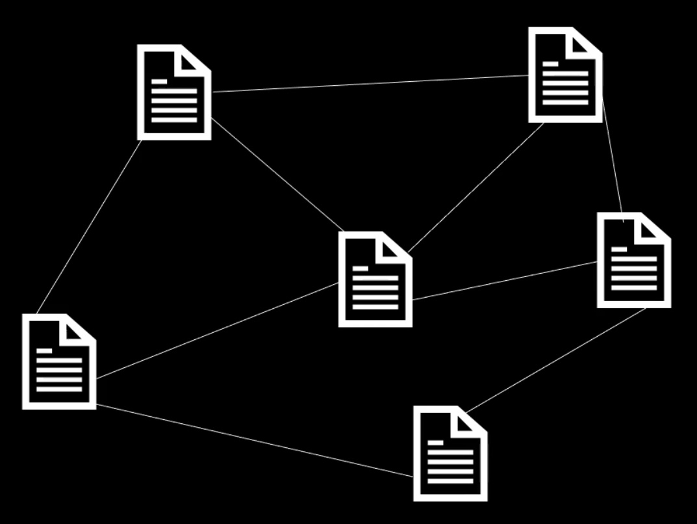

### What is Web Service

- WEB = World Wide Web : 정보의 그물망
  
- 하이퍼링크를 통해서 원하는 정보가 있는 위치로 바로 갈 수 있음

- URL : 정보자원이 어디 있는지를 나타내는 표식
- HTTP : 정보자원으로 접근하고 통신하게 해주는 약속

1. GET : "갖다 줘!" = "URL에 있는 내용을 갖다 줘!"
2. POST : "(이 데이터)처리해 줘!"

- HTML : 응답으로서의 정보 자원 자체 or 다른 정보 자원과 연결 매개체

- Web Service : HTML과 URL을 미리 준비해 놓고 사용자 요청에 대한 응답을 보낼 수 있는 프로그램

### What is Web Framework

- 프레임워크 : 웹 서비스를 쉽게 만들어주는 기계
- 정형화 : 정형화 되어있는 웹 개발을 효육적으로 하기 위해 미리 만들어 놓은 웹 개발의 기능단위, 설계 단위의 집합
- 웹페이지의 설계를 미리 준비해두는 것
- 라이브러리 VS 프레임워크

1. Framework : 명확한 목적을 달성하기 위해 이미 설계까지 만들어진 구조/뼈대
2. library : 도구의 모음

### MVC, MTV

1. DB와 상호작용하는 부분
2. 사용자들 눈에 보이는 부분
3. 내부 동작의 논리를 담당하는 부분

- 설계의 원칙 : "디자인 패턴"

- MVC

1. M = Model : 데이터베이스와 상호작용 담당
2. V = View : 사용자 인터페이스 담당
3. C = Controller : 웹 서비스 내부의 논리 담당

- MTV (장고)

1. M = Model : 데이터베이스와 상호작용 담당
2. T = Template : 사용자 인터페이스 담당
3. V = View : 웹 서비스 내부 동작의 논리를 담당
